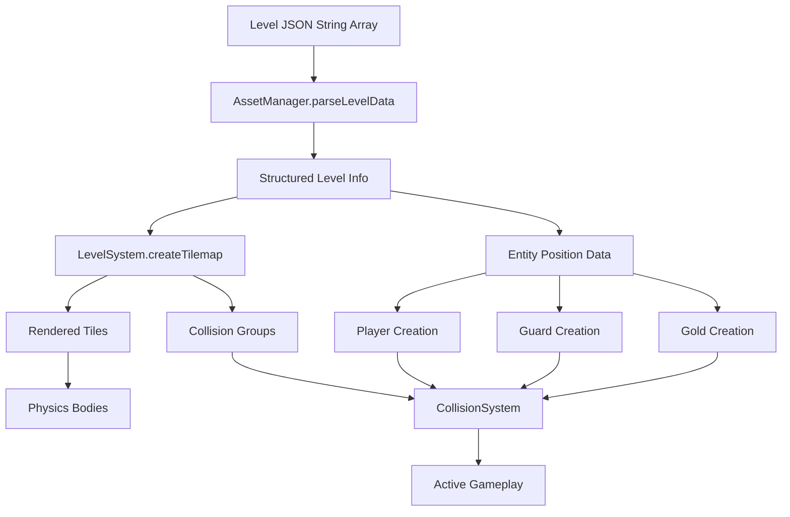

# 🏗️ Lode Runner Clone - Architecture Overview

## **Core Architecture Pattern: Scene-Entity-Manager**

```
┌─────────────────────────────────────────────────────┐
│                   Phaser Game                        │
├─────────────────────────────────────────────────────┤
│                     Scenes                           │
│  ┌────────┐ ┌─────────┐ ┌──────┐ ┌──────────┐     │
│  │ Boot   │→│ Preload │→│ Menu │→│   Game   │     │
│  └────────┘ └─────────┘ └──────┘ └──────────┘     │
│                                    ↓                 │
│                              ┌──────────┐           │
│                              │ GameOver │           │
│                              └──────────┘           │
├─────────────────────────────────────────────────────┤
│                    Entities                          │
│  ┌──────────────┐                                   │
│  │ BaseEntity   │ (Abstract parent class)           │
│  └──────┬───────┘                                   │
│         ├─────────┐      ┌─────────┐               │
│    ┌────▼───┐ ┌───▼──┐  │         │               │
│    │ Player │ │ Guard │  │  Holes  │               │
│    └────────┘ └───────┘  └─────────┘               │
├─────────────────────────────────────────────────────┤
│                   Managers                           │
│  ┌──────────┐ ┌──────────┐ ┌──────────┐           │
│  │  Asset   │ │  Input   │ │  Sound   │           │
│  │ Manager  │ │ Manager  │ │ Manager  │           │
│  └──────────┘ └──────────┘ └──────────┘           │
├─────────────────────────────────────────────────────┤
│                    Utils                             │
│  ┌──────────┐ ┌──────────┐ ┌──────────┐           │
│  │  Logger  │ │ClimbValid│ │HoleTime  │           │
│  └──────────┘ └──────────┘ └──────────┘           │
└─────────────────────────────────────────────────────┘
```

## **Directory Structure Analysis**

### **1. Scenes Layer** (`/src/scenes/`)
- **BootScene**: Initial setup and configuration
- **PreloadScene**: Asset loading with progress bar
- **MenuScene**: Main menu and game start
- **GameScene**: Core gameplay loop (**1,871 lines** - needs refactoring)
- **GameOverScene**: End game state and restart

### **2. Entity System** (`/src/entities/`)
- **BaseEntity**: Abstract parent providing common physics/animation
- **Player**: Player-specific mechanics (climbing, digging, collision)
- **Guard**: AI behavior with 11 animation states and pathfinding
- *Missing*: Hole entity (currently managed in GameScene)

### **3. Manager Pattern** (`/src/managers/`)
- **AssetManager**: Centralized asset loading and access
- **InputManager**: Keyboard input handling and mapping
- **SoundManager**: Audio playback and management

### **4. Utilities** (`/src/utils/`)
- **Logger**: Environment-aware logging
- **ClimbValidation**: Ladder/rope climbing logic
- **HoleTimeline**: Hole lifecycle management

### **5. Configuration** (`/src/config/`)
- **GameConfig**: Centralized game constants and settings

### **6. Systems** (`/src/systems/`)
- **Currently Empty**: Planned but not implemented

## **Architectural Strengths** ✅
1. **Entity inheritance hierarchy** - Clean OOP design
2. **Manager pattern** - Separation of concerns
3. **Scene flow** - Well-defined game state transitions
4. **Type safety** - TypeScript throughout
5. **Asset organization** - Clear public/assets structure

## **Architectural Weaknesses** ⚠️

### 🚨 **Critical Finding: GameScene Monolith**
- **Current size**: 1,871 lines (52+ methods)
- **Best practice**: 300-500 lines max
- **Impact**: Unmaintainable, untestable, tightly coupled

### **Current Responsibilities (Anti-Pattern)**
1. **Level Management** - Tilemap parsing, tile collision setup
2. **Hole System** - Digging, filling, restoration, timers
3. **Exit System** - Ladder reveal, completion detection
4. **Collision System** - Player-guard, guard-guard, tile collisions
5. **UI Management** - Score, lives, gold count display
6. **Debug System** - Overlays, debug text, visualization
7. **Entity Creation** - Player and guard instantiation
8. **Game State** - Score tracking, level progression
9. **Input Handling** - Pause, debug toggle
10. **Audio Triggers** - Sound effect coordination

## 🏗️ **Proposed System Extraction Strategy**

### **Phase 1: Extract Core Systems** (Highest Impact)

#### **1. HoleSystem** (`/src/systems/HoleSystem.ts`)
```typescript
export class HoleSystem {
  private holes: Map<string, HoleData>;
  private holeTimeline: HoleTimeline;
  
  digHole(x: number, y: number, direction: 'left' | 'right'): void
  fillHole(key: string): void
  restoreHole(key: string): void
  checkHoleCollisions(player: Player, guards: Guard[]): void
  update(time: number, delta: number): void
}
```

#### **2. LevelSystem** (`/src/systems/LevelSystem.ts`)
```typescript
export class LevelSystem {
  private tilemap: Phaser.Tilemaps.Tilemap;
  private solidTiles: Phaser.Physics.Arcade.StaticGroup;
  
  loadLevel(levelData: any): void
  createTilemap(tiles: number[][]): void
  getTileAt(x: number, y: number): TileType
  isTileDiggable(x: number, y: number): boolean
}
```

#### **3. ExitSystem** (`/src/systems/ExitSystem.ts`)
```typescript
export class ExitSystem {
  private exitLadderSprites: Phaser.GameObjects.Sprite[];
  private exitMarker: Phaser.GameObjects.Text;
  
  checkGoldCollected(): boolean
  revealExitLadder(): void
  checkExitReached(player: Player): boolean
}
```

### **Phase 2: Event-Driven Architecture**

#### **EventBus Implementation**
```typescript
// /src/systems/EventBus.ts
export class EventBus extends Phaser.Events.EventEmitter {
  static instance: EventBus;
  
  // Game Events
  static readonly GOLD_COLLECTED = 'gold-collected';
  static readonly HOLE_DUG = 'hole-dug';
  static readonly GUARD_TRAPPED = 'guard-trapped';
  static readonly LEVEL_COMPLETE = 'level-complete';
}
```

### **Phase 3: Registry Pattern**

#### **SystemRegistry** (`/src/systems/SystemRegistry.ts`)
```typescript
export class SystemRegistry {
  private systems: Map<string, BaseSystem>;
  
  register<T extends BaseSystem>(name: string, system: T): void
  get<T extends BaseSystem>(name: string): T
  updateAll(time: number, delta: number): void
}
```

## 📋 **Architectural Improvement Roadmap**

### **🎯 Priority Matrix**

| Priority | System | Complexity | Impact | Lines to Extract |
|----------|--------|------------|--------|------------------|
| **P0** | HoleSystem | High | Critical | ~400 lines |
| **P0** | LevelSystem | Medium | Critical | ~300 lines |
| **P1** | ExitSystem | Low | High | ~150 lines |
| **P1** | CollisionSystem | High | High | ~250 lines |
| **P2** | DebugSystem | Low | Medium | ~200 lines |
| **P2** | UISystem | Low | Medium | ~150 lines |
| **P3** | EventBus | Medium | High | New |
| **P3** | SystemRegistry | Low | Medium | New |

### **📅 Implementation Timeline**

#### **Sprint 1: Core Extraction (Week 1)**
- [ ] Extract HoleSystem with existing HoleTimeline
- [ ] Extract LevelSystem with tilemap management
- [ ] Update GameScene to use new systems
- [ ] Add unit tests for extracted systems

#### **Sprint 2: Game Flow (Week 2)**
- [ ] Extract ExitSystem with completion logic
- [ ] Extract CollisionSystem with physics handling
- [ ] Implement basic EventBus for system communication
- [ ] Reduce GameScene to < 800 lines

#### **Sprint 3: Polish (Week 3)**
- [ ] Extract DebugSystem for dev tools
- [ ] Extract UISystem for HUD management
- [ ] Implement SystemRegistry for centralized updates
- [ ] Add performance monitoring

### **🎨 Target Architecture**

```typescript
// GameScene.ts (After Refactoring) - Target: 500-600 lines
export class GameScene extends Scene {
  private registry: SystemRegistry;
  private eventBus: EventBus;
  
  create() {
    // Initialize systems
    this.registry.register('hole', new HoleSystem(this));
    this.registry.register('level', new LevelSystem(this));
    this.registry.register('exit', new ExitSystem(this));
    
    // Wire event listeners
    this.eventBus.on(EventBus.GOLD_COLLECTED, this.onGoldCollected);
    this.eventBus.on(EventBus.LEVEL_COMPLETE, this.onLevelComplete);
  }
  
  update(time: number, delta: number) {
    this.registry.updateAll(time, delta);
  }
}
```

## **✅ Success Metrics**

1. **Code Quality**
   - GameScene reduced from 1,871 → 500-600 lines
   - Each system < 300 lines
   - Test coverage > 80%

2. **Performance**
   - Maintain 30 FPS target
   - Reduce update loop overhead by 20%
   - Memory usage stable

3. **Maintainability**
   - Single Responsibility Principle achieved
   - Loose coupling via events
   - Clear system boundaries

## **⚠️ Risk Mitigation**

| Risk | Mitigation Strategy |
|------|-------------------|
| Breaking existing gameplay | Incremental extraction with tests |
| Performance regression | Profile before/after each extraction |
| Lost functionality | Maintain feature parity checklist |
| Merge conflicts | Work in feature branches |

## **Element Sizes and Body Properties**

### **Base Configuration**
- **Tile Size**: 32px × 32px (base unit for all positioning)
- **Half Tile Size**: 16px (used for centering sprites)
- **Level Dimensions**: 28 × 16 tiles (896 × 512 pixels)
- **Game Canvas**: 896 × 600 pixels (includes 88px UI space)
- **Scaling Strategy**: 1.6× universal scale for visual consistency

### **Tile Elements**

| Element | Original Size | Scale | Display Size | Physics Body | Depth |
|---------|--------------|-------|--------------|--------------|-------|
| **Brick** | 20×20px | 1.6× | 32×32px | Static, 32×32px | 10 |
| **Solid** | 20×20px | 1.6× | 32×32px | Static, 32×32px | 10 |
| **Ladder** | 20×20px | 1.6× | 32×32px | Static, 32×32px | 10 |
| **Rope** | 20×20px | 1.6× | 32×32px | Static, 32×32px | 10 |
| **Hole** | 20×20px | 1.6× | 32×32px | None (visual only) | 50 |
| **Exit Ladder** | 20×20px | 1.6× | 32×32px | Static, 32×32px | 100 |

### **Player Entity**

#### **Sprite Properties**
- **Texture**: 'runner' atlas
- **Base Frame**: 'runner_00'
- **Scale**: 1.6×
- **Display Size**: ~32×32px (after scaling)
- **Render Depth**: 1000

#### **Physics Body** (Compensated for 1.6× scale)
```typescript
{
  width: 10px,      // 16 ÷ 1.6 (narrow for ladder alignment)
  height: 17.5px,   // 28 ÷ 1.6 (fits through tunnels)
  offsetX: 5px,     // 8 ÷ 1.6 (centers collision box)
  offsetY: 2.5px,   // 4 ÷ 1.6 (fine-tune position)
  gravity: 800,
  collideWorldBounds: true
}
```

#### **Movement Parameters**
- **Horizontal Speed**: 200 (actual) / 100 (config default)
- **Climb Speed**: Equal to horizontal speed
- **Fall Speed**: Controlled by gravity (800)

### **Guard Entity**

#### **Sprite Properties**
- **Texture**: 'guard' atlas
- **Base Frame**: 'guard_00'
- **Scale**: 1.6×
- **Display Size**: ~32×32px (after scaling)
- **Render Depth**: 1000

#### **Physics Body** (Critical for tunnel navigation)
```typescript
{
  width: 10px,      // Very narrow for precise movement
  height: 16px,     // CRITICAL: Half tile size for tunnel clearance
  offsetX: 3px,     // Centers narrow collision box
  offsetY: 4px,     // Fine-tune vertical position
  gravity: 600,     // Slightly less than player
  bounce: 0.1,      // Minor bounce on landing
  collideWorldBounds: true
}
```

#### **AI Parameters**
- **Movement Speed**: 80 (actual) / 60 (config default)
- **Decision Interval**: 500ms (AI recalculation rate)
- **Pathfinding Cooldown**: Variable
- **Stun Duration**: 2000ms (when trapped in hole)
- **Respawn Delay**: 3000ms (after death)

### **Gold Sprites**
- **Display Size**: 32×32px (scaled at 1.6×)
- **Original Size**: 20×20px
- **Physics**: Static body, 32×32px
- **Depth**: 200
- **Collection**: Overlap detection with player

### **Collision Design Philosophy**

#### **Key Principles**
1. **Tunnel Navigation**: Guard height (16px) is exactly half tile size for guaranteed passage
2. **Ladder Alignment**: Both entities use 10px width for precise ladder centering
3. **Scale Compensation**: `actualBodySize = configuredSize ÷ spriteScale`
4. **Forgiving Collisions**: Physics bodies smaller than visual sprites

#### **Depth Layering** (z-order)
```
10    - Standard tiles (bricks, solids, ladders, ropes)
50    - Holes (below ropes/ladders for visual clarity)
100   - Tiles above holes, Exit ladder
200   - Gold collectibles
1000  - Player and Guards
1000  - Debug graphics overlay
```

### **Critical Measurements**

| Measurement | Value | Purpose |
|-------------|-------|---------|
| **Tunnel Height** | 32px | Single tile vertical gap |
| **Guard Body Height** | 16px | **Must be < 32px** for tunnel passage |
| **Player Body Height** | 17.5px | **Must be < 32px** for tunnel passage |
| **Ladder Width** | 32px | Full tile width |
| **Entity Body Width** | 10px | **Must be < 32px** for ladder centering |
| **Hole Duration** | 5000ms | Time before hole restoration |
| **Guard Stun** | 2000ms | Mandatory stun in hole |

### **Physics Configuration Summary**

```typescript
// Universal physics settings
{
  gravity: { y: 800 },        // Player gravity
  guardGravity: { y: 600 },   // Guard gravity (lighter)
  worldBounds: {
    x: 0, y: 0,
    width: 896,  // 28 tiles × 32px
    height: 512  // 16 tiles × 32px
  }
}
```

## **Level Initialization Process**

### **1. Asset Loading Phase** (`PreloadScene`)

#### **Level Data Structure**
```typescript
// Loaded from /assets/levels/classic.json
{
  "level-001": [
    "                            ",  // Row 0
    "         $                  ",  // Row 1 ($=gold)
    "    H-----------H    $      ",  // Row 2 (H=ladder, -=rope)
    "    H           H######H    ",  // Row 3 (#=brick)
    "    H $         H      H    ",  // Row 4
    // ... more rows
    "################H##########S",  // Row 15 (S=exit ladder)
  ]
}
```

#### **Asset Loading Sequence**
1. **Sprite Atlases**: runner.json, guard.json, tiles.json, holes.json
2. **Animation Definitions**: player-anims.json, guard-anims.json
3. **Level Data**: classic.json (150 levels)
4. **Audio Assets**: dig.wav, gold.wav, dead.wav, pass.mp3
5. **Animation Creation**: Post-load processing

### **2. Game Scene Initialization Flow**

```typescript
// GameScene.create() execution order
1. initializeGameState()      // Preserve score/lives between levels
2. initializeAudio()           // SoundManager setup
3. initializeTimelineSystem()  // HoleTimeline for hole mechanics
4. initializeClimbValidation() // Ladder/rope detection system
5. setupInput()                // InputManager configuration
6. initializeCollisionSystem() // Physics groups creation
7. levelSystem.loadLevel()     // Parse and render level
8. createPlayer()              // Spawn at '&' position
9. createGuards()              // Spawn at '0' positions
10. createUI()                 // HUD elements
11. setupEntityCollisions()    // Wire collision callbacks
```

### **3. Level Data Parsing** (`AssetManager.parseLevelData()`)

#### **Character Mapping Table**

| Character | Tile Type | Entity/Special | Pixel Position |
|-----------|-----------|----------------|----------------|
| ` ` (space) | EMPTY (0) | None | N/A |
| `#` | BRICK (1) | Diggable tile | tileX×32, tileY×32 |
| `H` | LADDER (3) | Climbable | tileX×32, tileY×32 |
| `-` | ROPE (4) | Hangable | tileX×32, tileY×32 |
| `@` | SOLID (5) | Undiggable | tileX×32, tileY×32 |
| `$` | EMPTY (0) | Gold sprite | tileX×32+16, tileY×32+16 |
| `&` | EMPTY (0) | Player spawn | tileX×32+16, tileY×32+16 |
| `0` | EMPTY (0) | Guard spawn | tileX×32+16, tileY×32+16 |
| `S` | EXIT_LADDER (6) | Hidden exit | Topmost in column |

#### **Extraction Process**
```typescript
parseLevelData(levelString: string[]) {
  const tiles: number[][] = [];
  const entities = { player: null, guards: [], gold: [], exit: null };
  
  levelString.forEach((row, y) => {
    row.split('').forEach((char, x) => {
      const pixelPos = { x: x * 32, y: y * 32 };
      
      switch(char) {
        case '&': entities.player = { x: pixelPos.x + 16, y: pixelPos.y + 16 }; break;
        case '0': entities.guards.push({ x: pixelPos.x + 16, y: pixelPos.y + 16 }); break;
        case '$': entities.gold.push({ x: pixelPos.x + 16, y: pixelPos.y + 16 }); break;
        case 'S': entities.exit = { x, y }; break; // Store tile coords
      }
      
      tiles[y][x] = charToTileType(char);
    });
  });
  
  return { tiles, entities };
}
```

### **4. Tilemap Creation** (`LevelSystem.createTilemap()`)

#### **Rendering Pipeline**
1. **Clear Previous Level**: Destroy existing sprites and groups
2. **Create Tile Grid**: 2D array for O(1) lookups
3. **Sprite Creation**: 
   ```typescript
   const tile = scene.add.sprite(
     pixelX + 16,  // Center in tile
     pixelY + 16,  // Center in tile
     'tiles',      // Texture atlas
     frameKey      // 'brick_01', 'ladder_01', etc.
   );
   tile.setScale(1.6);
   tile.setDepth(10);
   ```
4. **Physics Registration**: Add to appropriate collision group
5. **Storage**: Dual storage in Map and 2D array

### **5. Entity Creation Sequence**

#### **Gold Collection** (`LevelSystem.createGoldSprites()`)
```typescript
goldPositions.forEach(pos => {
  const gold = scene.add.sprite(pos.x, pos.y, 'tiles', 'gold');
  gold.setScale(1.6);
  gold.setDepth(200);
  scene.physics.add.existing(gold, true); // Static body
  goldSprites.add(gold);
});
```

#### **Player Instantiation** (`GameScene.createPlayer()`)
```typescript
this.player = new Player(
  {
    scene: this,
    x: playerStart.x,
    y: playerStart.y,
    texture: 'runner',
    frame: 'runner_00',
    scale: 1.6,
    depth: 1000
  },
  this.inputManager,
  this.soundManager
);
```

#### **Guard Creation** (`GameScene.createGuards()`)
```typescript
guardPositions.forEach(pos => {
  const guard = new Guard(
    this,
    pos.x,
    pos.y,
    this.player.sprite
  );
  this.guards.push(guard);
});
```

### **6. Collision System Setup**

#### **Physics Groups**
```typescript
// Static groups for tiles
this.solidTiles = this.physics.add.staticGroup();
this.ladderTiles = this.physics.add.staticGroup();
this.ropeTiles = this.physics.add.staticGroup();
this.goldSprites = this.physics.add.staticGroup();

// Dynamic groups for entities
this.playerGroup = this.physics.add.group([this.player.sprite]);
this.guardGroup = this.physics.add.group(guards.map(g => g.sprite));
```

#### **Collision Callbacks**
```typescript
// Player-Gold collection
this.physics.add.overlap(player, goldSprites, collectGold);

// Player-Guard collision
this.physics.add.overlap(player, guardGroup, handlePlayerDeath);

// Guard-Guard platform prevention
this.physics.add.collider(guardGroup, guardGroup);

// Entity-Tile collisions
this.physics.add.collider([player, guardGroup], solidTiles);
```

### **7. Game State Initialization**

```typescript
gameState = {
  currentLevel: preservedLevel || 1,
  score: preservedScore || 0,
  lives: preservedLives || 5,
  goldCollected: 0,              // Reset per level
  totalGold: goldPositions.length // From parsed level
}
```

### **8. UI Creation** (`GameScene.createUI()`)

#### **HUD Elements**
- **Score**: Top-left at (10, 520)
- **Level**: Top-center at (400, 520)
- **Lives**: Top-right at (700, 520)
- **Gold Counter**: Below score at (10, 540)
- **Instructions**: Toggle with 'I' key

### **9. Startup Sequence**

```typescript
// Final initialization steps
1. player.setInvincibility(2000);  // 2-second spawn protection
2. debugMode = false;               // Debug overlay off
3. exitLadder.setVisible(false);    // Hidden until gold collected
4. scene.time.addEvent({            // Start game loop
     delay: 16,
     callback: update,
     loop: true
   });
```

### **10. Level Initialization Data Flow**



### **Key Initialization Parameters**

| Parameter | Value | Source | Purpose |
|-----------|-------|--------|---------|
| **Tile Size** | 32px | GAME_CONFIG | Base unit for positioning |
| **Sprite Scale** | 1.6× | Hardcoded | Visual consistency |
| **Level Width** | 28 tiles | GAME_CONFIG | Horizontal bounds |
| **Level Height** | 16 tiles | GAME_CONFIG | Vertical bounds |
| **Player Gravity** | 800 | GAME_MECHANICS | Fall speed |
| **Guard Gravity** | 600 | Entity config | Lighter than player |
| **Hole Duration** | 5000ms | GAME_MECHANICS | Restoration timer |
| **Invincibility** | 2000ms | GAME_MECHANICS | Spawn protection |

## **Technology Stack**
- **Framework**: Phaser.js 3.85+
- **Language**: TypeScript
- **Build**: Vite 6.0+
- **Deployment**: Netlify
- **Testing**: Custom MCP-based test framework

## **Physics Body Behavior in Phaser**

### **Static vs Dynamic Body Sizing**

In Phaser.js, physics body sizing behaves differently for static and dynamic bodies:

#### **Static Bodies (Tiles, Gold, Ladders)**
When creating a static physics body:
```typescript
sprite.setScale(1.6);                    // Scales 20×20px → 32×32px display
scene.physics.add.existing(sprite, true); // Static body
```

**Default Behavior**:
- Physics body automatically matches the **scaled display size** (32×32px)
- NOT the original texture size (20×20px)
- This ensures full collision coverage for scaled sprites

#### **Dynamic Bodies (Player, Guards)**
Dynamic bodies require manual sizing:
```typescript
sprite.setScale(1.6);
scene.physics.add.existing(sprite, false); // Dynamic body
const body = sprite.body as Phaser.Physics.Arcade.Body;
body.setSize(width / 1.6, height / 1.6);  // Compensate for scale
```

**Key Points**:
1. Static bodies auto-adjust to display bounds (width × scaleX, height × scaleY)
2. Dynamic bodies can be manually sized for precise collision
3. In this codebase, all static tiles have 32×32px bodies matching their visual size
4. Player/Guard have custom smaller bodies for gameplay needs

## **Design Rationale: Player vs Guard Physics**

### **Physics Body Differences**

| Entity | Width | Height | Gravity | Bounce | Rationale |
|--------|-------|--------|---------|--------|-----------|
| **Player** | 10px | 17.5px | 800 | 0 | Human control precision |
| **Guard** | 10px | 16px | 600 | 0.1 | AI navigation reliability |

### **Critical Design Decisions**

#### **1. Guard Height = 16px (Exactly Half Tile Size)**
```typescript
// Guard physics - CRITICAL for AI navigation
{
  height: 16,  // MUST be < 32px for tunnel passage
              // 16px = exactly half tile = maximum safety margin
}
```

**Why**: Guards use AI pathfinding and cannot manually adjust like players. The 16px height guarantees passage through any single-tile (32px) vertical gap, preventing AI from getting stuck.

#### **2. Player Height = 17.5px (Slightly Taller)**
```typescript
// Player physics - Optimized for human control
{
  height: 17.5,  // Still < 32px but tighter fit
                 // Provides better platform edge detection
}
```

**Why**: Human players can manually adjust position and timing. The slightly taller body provides:
- More precise platform edge detection
- Better "standing on tile" feel
- Skill-based navigation challenge

#### **3. Different Gravity Settings**
- **Player (800)**: Heavier gravity for responsive, snappy control
- **Guard (600)**: Lighter gravity for predictable AI movement patterns

#### **4. Guard Bounce = 0.1**
Small bounce helps guards recover from falls and prevents them from getting stuck in geometry edge cases that AI might not handle well.

### **Historical Context**
From commit history and code comments:
- Guards previously got stuck in tunnels and at ladder tops
- The 16px height was a deliberate fix (commits: "Fix Guard AI ladder climbing and stuck-at-top issues")
- This is why the code emphasizes: "CRITICAL: Height must be much smaller than tile size"

### **Gameplay Impact**
The 1.5px height difference between Player (17.5px) and Guard (16px) is subtle but important:
- **Guards**: Reliable movement ensures consistent game challenge
- **Player**: Tighter tolerances reward skilled play
- **Balance**: Player skill vs AI reliability

This design ensures guards provide a consistent threat while giving players the tools for precise, skill-based gameplay.

## **Performance Considerations**
- 30 FPS target for smooth animations
- Object pooling needed for transient sprites
- Event-driven architecture would reduce coupling
- System registry pattern for better observability

## 🏆 **Executive Summary**

Your Lode Runner clone has solid foundations but suffers from a **critical architectural debt**: the 1,871-line `GameScene` monolith. The proposed refactoring would:

1. **Extract 6 dedicated systems** from GameScene
2. **Reduce complexity** by 70% (1,871 → 500-600 lines)
3. **Improve testability** through isolated systems
4. **Enable scalability** via event-driven architecture

### **Immediate Action Items**

1. **Start with HoleSystem** - Highest impact, already has HoleTimeline utility
2. **Use feature branches** - Prevent breaking main gameplay
3. **Add tests first** - Ensure behavior preservation
4. **Profile performance** - Monitor 30 FPS target

The empty `/src/systems/` directory shows this refactoring was already planned - now you have a concrete roadmap to execute it.